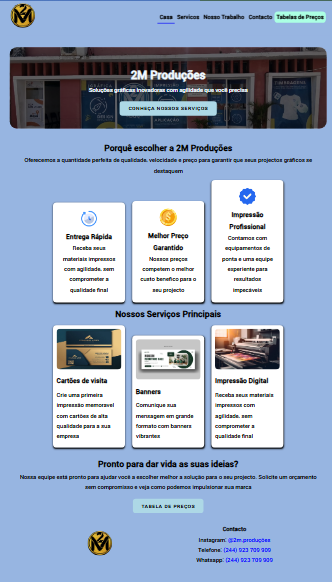
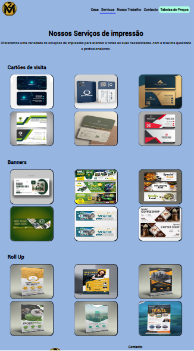
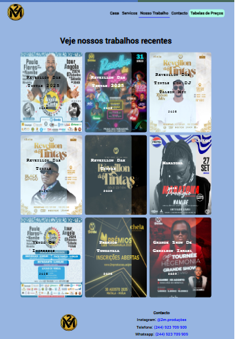
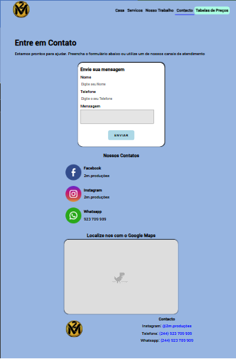
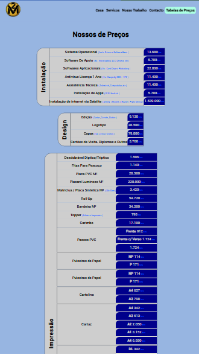
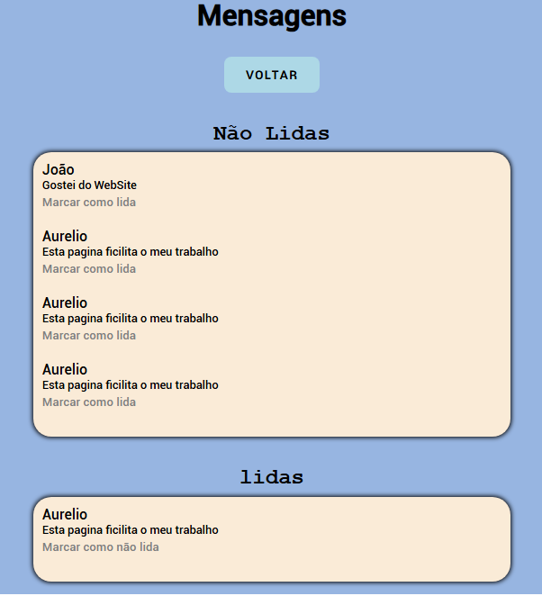

# 2M Produções WebApp

    Olá e seja Bem Vindo este é um Projecto de uma aplicação web criada por <abbr tittle="Casimiro Choia - Programador Full Stack com Javascript">DevCasi</abbr>, com a finalidade de servir como WebApp padrão da Empresa <strong>2M Produções</strong>

## Capturas de tela

Podemos ver algumas capturas de tela da Pagina Como ela é:

    
    

    Acima podemos Observar a tela principal
    onde temos uma breve apresentaçãos da empresa, o que ela pode fazer e seu contacto no Rodapé
    

 

    
    

    A segunda tela é a tela de alguns serviços já feitos pela empresa como cartões de visita, Roll Up's, banners e muito mais
    

    
    

    Acima podemos ver artistas que já fizeram parceria e alguns eventos já Organisados pela empresa.
    

    
    

    Nesta Pagina de Contacto Podemos Ver um formulária que ao ser preenchido envia uma mensagem à Empresa.
    

    
    

    Nesta imagem nós vemos as tabelas de preços da empresa.
    

    
    

    E por ultimo e não menos importante, a tela onde as mensagens serão exibidas.
    

    Uma Criação de DevCasi (Casimiro Choia) para a empresa 2M Produções

